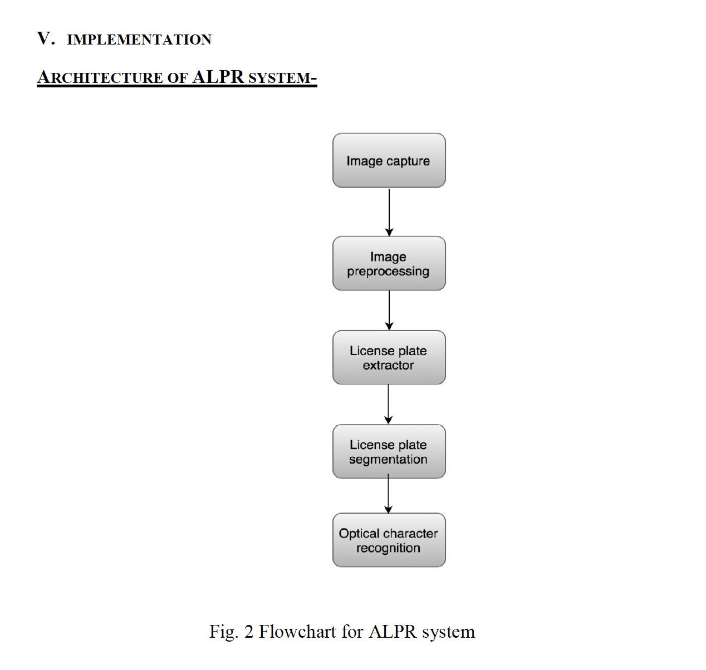

# Automatic-License-Plate-Reader (ALPR)
This repository contains the source code and supporting images that uses Optical Character Recognition (OCR) method to read the license plate of a car and convert it into alphanumeric characters.
## Getting Started

### Requirements- 
- openCV
- [Tesseract](https://github.com/tesseract-ocr/tesseract)

Implementation of ALPR system can be found below - 

